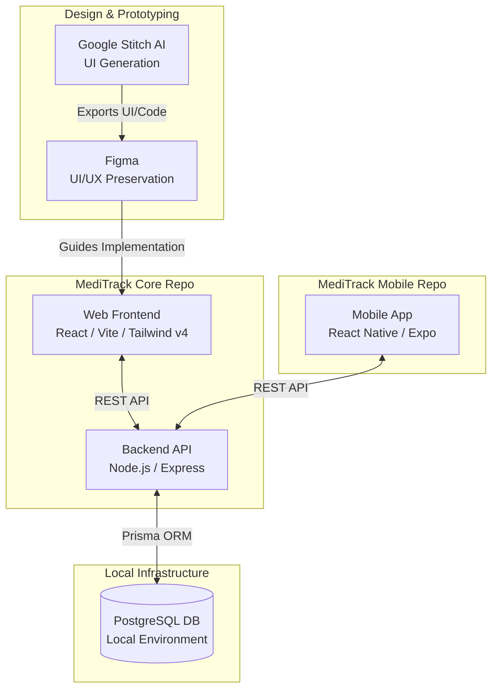
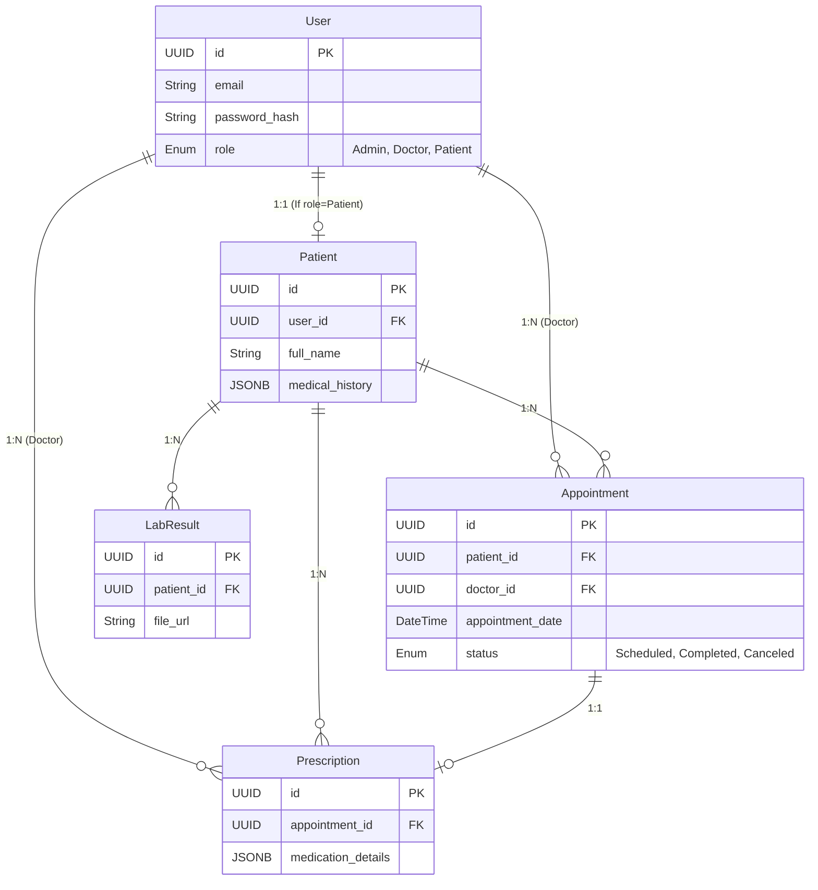
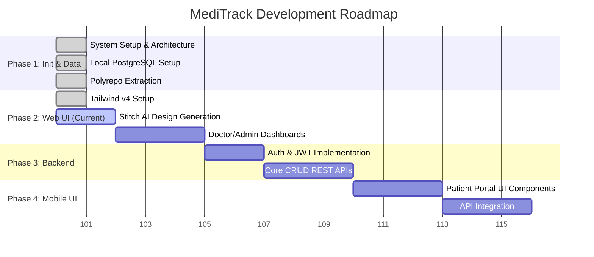

# MediTrack - System Architecture & Roadmap

This document provides a visual overview of the MediTrack system architecture, database schema, and project development roadmap.

## 1. System Architecture (Polyrepo & Local DB)

We utilize a Polyrepo approach to decouple the mobile application lifecycle from the core web and backend services. We follow a **UI-Driven Development** approach using Figma and Google Stitch AI to establish requirements before building backend logic.

## 2. Database Entity Relationship Diagram (ERD)

The core data model utilizing PostgreSQL features like JSONB and UUIDs.

## 3. Development Roadmap (UI-Driven Approach)

